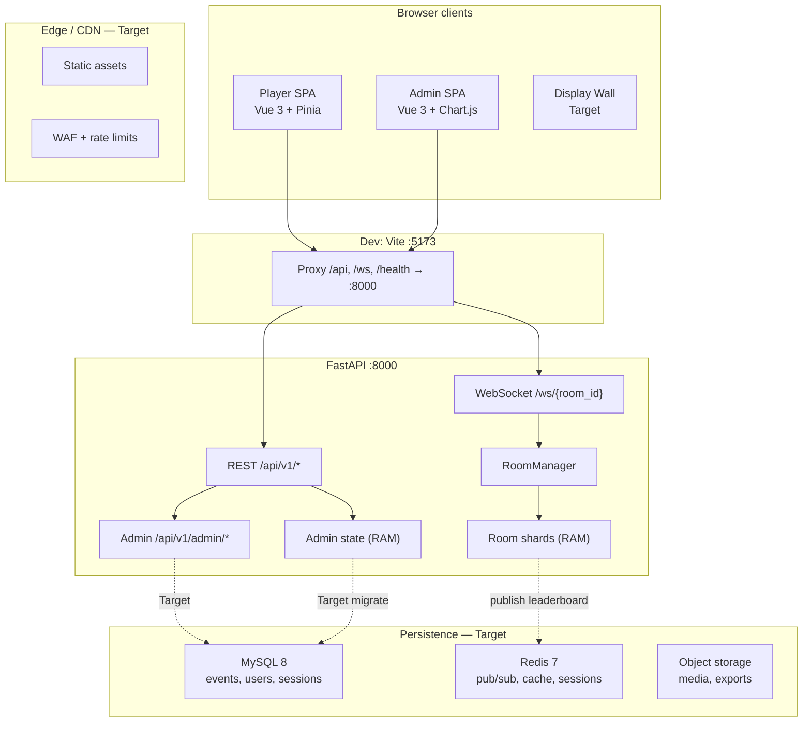
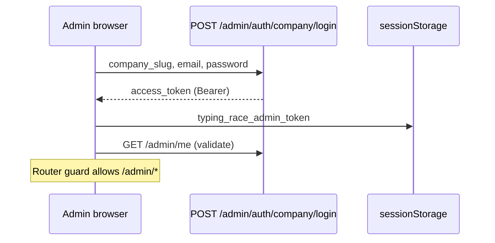
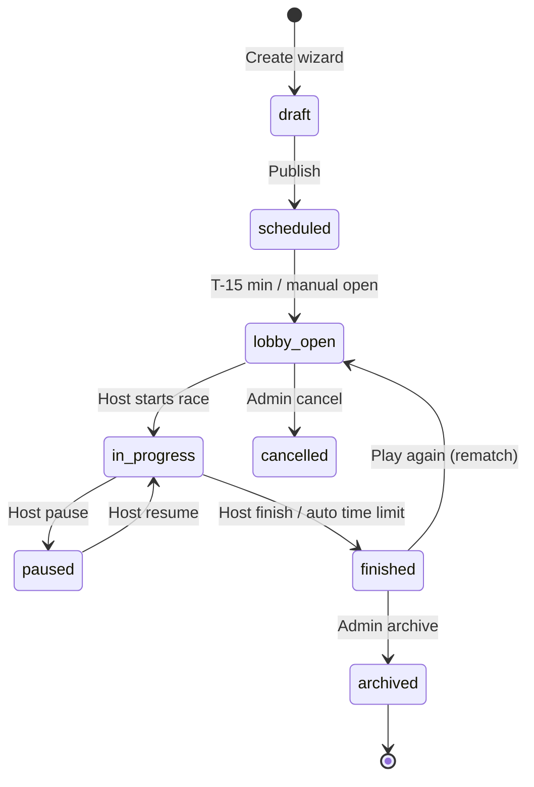
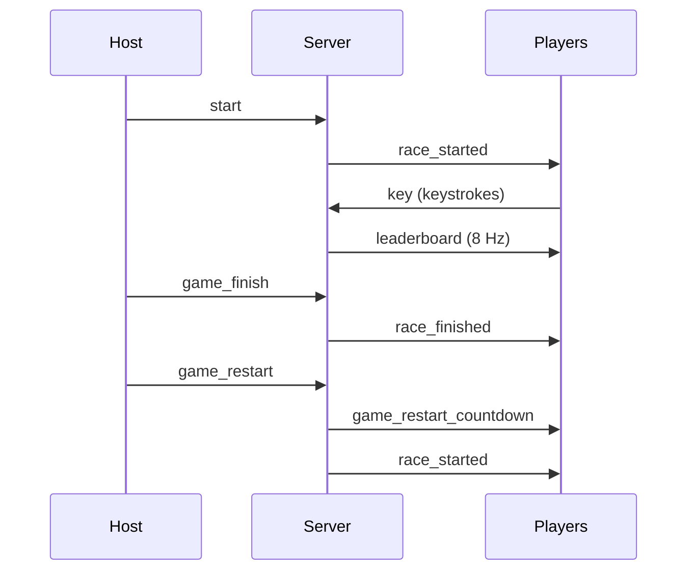
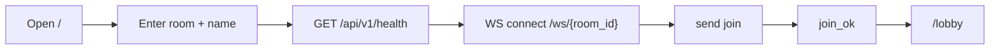
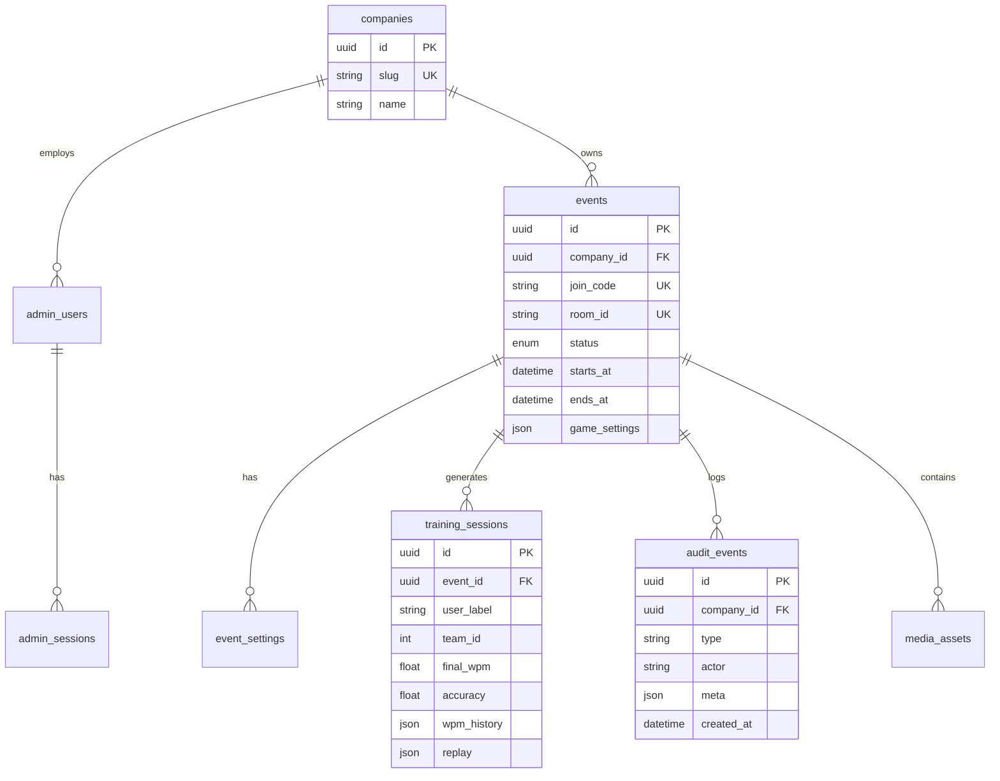

# Typing Race — Admin Panel & Event Management

**Product documentation & feature specification**

| Field | Value |
|-------|-------|
| Product | Typing Race — multiplayer real-time typing competition |
| API service | `typing-race-api` |
| Document version | 1.0 |
| Last updated | 2026-05-20 |
| Audience | Platform admins, event hosts, engineers, SRE |

---

## Implementation status legend

| Badge | Meaning |
|-------|---------|
| **v1** | Implemented in the current repository |
| **Partial** | Partially implemented; gaps noted |
| **Target** | Production enterprise specification (not yet built) |

This document describes **both** the shipping v1 behavior and the **target** enterprise platform. Sections are tagged inline where behavior differs.

---

## Table of contents

1. [Overview](#1-overview)
2. [System Architecture](#2-system-architecture)
3. [Authentication](#3-authentication)
4. [Admin Dashboard](#4-admin-dashboard)
5. [Event Lifecycle](#5-event-lifecycle)
6. [Event Creation Wizard](#6-event-creation-wizard)
7. [Game Mode Configuration](#7-game-mode-configuration)
8. [Event Control Centre](#8-event-control-centre)
9. [Team Management](#9-team-management)
10. [Player Management](#10-player-management)
11. [Match Management](#11-match-management)
12. [Room Management](#12-room-management)
13. [Live Monitoring](#13-live-monitoring)
14. [Leaderboards](#14-leaderboards)
15. [Reports & Analytics](#15-reports--analytics)
16. [Media / Gallery](#16-media--gallery)
17. [Public Display Wall](#17-public-display-wall)
18. [Player Join Flow](#18-player-join-flow)
19. [Gameplay Flow](#19-gameplay-flow)
20. [Scoring System](#20-scoring-system)
21. [Ranking Logic](#21-ranking-logic)
22. [Real-time WebSocket Events](#22-real-time-websocket-events)
23. [Export System](#23-export-system)
24. [Notifications](#24-notifications)
25. [Environment Variables](#25-environment-variables)
26. [API Reference](#26-api-reference)
27. [Security](#27-security)
28. [Rate Limiting](#28-rate-limiting)
29. [Logging & Audit Trail](#29-logging--audit-trail)
30. [Troubleshooting](#30-troubleshooting)
31. [Quick Reference URLs](#31-quick-reference-urls)

---

## 1. Overview

### Purpose

Typing Race is a browser-based multiplayer typing competition. Players join a **room** (logical event session), type a shared paragraph in real time, and compete on **WPM**, **accuracy**, and **progress**. Teams (A/B) can play in **relay mode** where only one active typist per team types at a time.

The **Admin Panel** provides company operators with:

- Authentication into a protected admin shell
- Training session analytics (WPM, accuracy, team breakdown)
- Audit event history
- PDF export of summary reports

The **Event Management System** (target) extends this into scheduled corporate events with join codes, QR onboarding, host control, live display walls, and persistent reporting.

### Product surfaces

| Surface | URL (dev) | Status |
|---------|-----------|--------|
| Player join | `http://localhost:5173/` | **v1** |
| Lobby | `/lobby` | **v1** |
| Race | `/game` | **v1** |
| Results | `/results` | **v1** |
| Admin login | `/admin/login` | **v1** |
| Admin dashboard | `/admin` | **v1** |
| Admin sessions | `/admin/sessions` | **v1** |
| Admin events | `/admin/events` | **v1** |
| Event wizard | `/admin/events/new` | **Target** |
| Control centre | `/admin/events/:id/control` | **Target** |
| Display wall | `/display/:eventCode` | **Target** |

### Design principles

- **Mobile-first**: Player UI is touch-friendly; admin tables collapse to cards on narrow viewports (**Partial** — admin is responsive but not fully mobile-optimized).
- **Real-time authoritative server**: All typing stats computed server-side; clients are views.
- **Logical room + shards**: One public `room_id` scales to multiple in-process shards for large events.
- **Host-gated controls**: Start, pause, finish, restart, and race length are host-only over WebSocket.

---

## 2. System Architecture

### Purpose

Describe how browser clients, API, WebSocket game plane, optional Redis, and (target) persistent storage interact.

### High-level diagram



### Component responsibilities

| Component | Responsibility | Status |
|-----------|----------------|--------|
| `frontend` (Vue 3) | Player race UI, 3D track, admin shell | **v1** |
| `backend/app/main.py` | FastAPI app, CORS, lifespan wiring | **v1** |
| `RoomManager` | Logical room config, sharding, host state | **v1** |
| `Room` | Per-shard players, broadcast loop, ranking | **v1** |
| `typing_engine` | Paragraph generation, keystroke stats | **v1** |
| `admin/state.py` | In-memory events, sessions, tokens | **v1** |
| `RedisBus` | Leaderboard pub/sub fan-out | **Partial** (publish only) |
| MySQL | Durable events, RBAC, reports | **Target** |
| Background workers | Export jobs, email, aggregation | **Target** |

### Backend behavior (v1)

- Single Python process holds all game state in RAM.
- Restart clears rooms, admin sessions, and analytics buffers.
- Optional `REDIS_URL` publishes lite leaderboard JSON to `typingrace:lb:{logical_room}:{shard}`; no subscriber in-process yet.

### Database behavior

| Data | v1 | Target |
|------|----|--------|
| Admin tokens | In-memory dict, 7-day TTL | Redis or MySQL `admin_sessions` |
| Training sessions | Deque, max 200 | MySQL `training_sessions` |
| Audit events | Deque, max 500 | MySQL `audit_events` + immutable log |
| Game rooms | In-memory per process | Ephemeral RAM + MySQL event metadata |
| Media files | N/A | S3-compatible object storage |

### Scaling recommendations (Target)

| Tier | Players | Architecture |
|------|---------|--------------|
| Dev | &lt; 20 | Single API instance, no Redis |
| Team event | 20–150 | Single API, Redis pub/sub for observers |
| Company event | 150–1,500 | Multiple API instances, sticky WS by `room_id`, Redis |
| Enterprise | 1,500+ | Dedicated game shards, MySQL read replicas, CDN for wall |

### Performance optimizations

- Leaderboard broadcast at 5–10 Hz (`BROADCAST_HZ`), lite payload per player.
- Per-player `y` map on leaderboard messages avoids broadcasting full player objects.
- Shard when `occupancy >= max_players_per_shard` (default 150).
- **Target**: Edge-cached display wall; pre-aggregated analytics materialized views.

---

## 3. Authentication

### Purpose

Protect admin REST endpoints. Player game access is **room-scoped** (no account required in v1).

### UI description

**Admin Login** (`/admin/login`):

- Fields: Company slug, Email, Password
- Defaults shown in dev: `acme`, `admin@typingrace.local`
- Link back to player app
- Redirect to `/admin` or `?redirect=` path on success

### User flow



### Backend behavior (v1)

- Static credential check against env vars: `ADMIN_COMPANY_SLUG`, `ADMIN_EMAIL`, `ADMIN_PASSWORD`.
- On success: 128-char hex token stored in `_tokens` with 7-day expiry.
- Protected routes use `Authorization: Bearer <token>` → `require_admin` dependency.
- Logout revokes token in memory.

### Database behavior

| Table (Target) | Columns |
|----------------|---------|
| `companies` | `id`, `slug`, `name`, `created_at` |
| `admin_users` | `id`, `company_id`, `email`, `password_hash`, `role` |
| `admin_sessions` | `token_hash`, `user_id`, `expires_at`, `revoked_at` |

### API endpoints

See [§26 API Reference — Admin Auth](#admin-authentication).

### Permission requirements

| Role (Target) | Capabilities |
|---------------|--------------|
| `company_admin` | Full event CRUD, exports, user management |
| `event_host` | Control assigned events, no billing |
| `analyst` | Read-only analytics and exports |
| `display_operator` | Display wall token only |

**v1**: Single implicit `company_admin`; no RBAC.

### Error codes

| HTTP | `detail` | Cause |
|------|----------|-------|
| 401 | `unknown_company` | Slug mismatch |
| 401 | `invalid_credentials` | Email/password mismatch |
| 401 | `invalid_or_expired_token` | Missing, revoked, or expired Bearer token |
| 422 | Pydantic validation | Malformed body |

### Edge cases

- Token lost on server restart → client gets 401 on next request; redirected to login.
- Same browser can hold admin token **and** play a race; results auto-ingest when admin is signed in.
- **Target**: Refresh tokens, SSO (SAML/OIDC), MFA for company admins.

### Best practices

- Override default `changeme` password before any public deployment.
- Use HTTPS and `Secure` cookies when moving tokens from `sessionStorage` to httpOnly cookies (**Target**).

---

## 4. Admin Dashboard

### Purpose

Give operators at-a-glance training performance and recent activity.

### UI description (v1 — `AdminOverviewView`)

| Widget | Content |
|--------|---------|
| KPI cards | Session count, avg WPM, median WPM, recent peak WPM |
| Line chart | Blended WPM history (up to 60 buckets) |
| Bar chart | Team A vs Team B average final WPM |
| Table | Latest 8 training sessions |
| Action | **Export PDF report** (jsPDF) |

**Layout**: Sidebar navigation (Overview, Training sessions, Event history), company/email footer, sign out.

### User flow

1. Admin signs in → lands on `/admin`.
2. Page loads `GET /analytics/overview`, `GET /training/sessions?limit=30`, `GET /events?limit=40`.
3. Admin reviews KPIs and charts.
4. Optional: export PDF or drill into Sessions / Events.

### Backend behavior

`analytics_overview` aggregates in-memory sessions:

- Mean/median/max of `final_wpm`
- Team A (`team_id=0`) vs Team B (`team_id=1`) session counts and averages
- Per-index mean of `wpm_history` across sessions (blended curve)

### Real-time updates

**v1**: None — manual refresh or navigation. **Target**: SSE or WebSocket dashboard channel.

### Best practices

- Filter analytics by event ID and date range (**Target**).
- Show data freshness timestamp when using in-memory store (resets on deploy).

---

## 5. Event Lifecycle

### Purpose

Define states from event creation through teardown.

### State machine (Target)



### v1 mapping

v1 has **no formal Event entity**. A **logical room** (`room_id` in URL) acts as an ad-hoc session:

| Target state | v1 equivalent |
|--------------|---------------|
| `lobby_open` | Players joined, `started=false` |
| `in_progress` | `race_started` broadcast |
| `paused` | `game_paused` |
| `finished` | `race_finished` |
| Rematch | `game_restart` → countdown → `race_started` |

### Backend behavior

- Logical room config (`_LogicalRoomConfig`): `started`, `paused`, `finished`, `race_round`, `text_line_count`, `host_player_id`, `relay_mode`.
- Empty room → shards dropped, logical config removed.

### Edge cases

- Host disconnect → host transferred to next player (**v1**).
- Server restart → all state lost (**v1**); **Target** persist event metadata and allow rejoin.

---

## 6. Event Creation Wizard

**Status: Target** (not in v1 UI; spec for production)

### Purpose

Guide company admins through creating a typed race event with branding, rules, and join mechanics.

### Wizard steps

#### 6.1 Basic Details

| Field | Type | Validation |
|-------|------|------------|
| Event name | string | 3–120 chars, required |
| Description | markdown | max 2000 chars |
| Company | select | Must match admin company |
| Event type | enum | `training`, `tournament`, `showcase` |

#### 6.2 Schedule

| Field | Type | Validation |
|-------|------|------------|
| Start datetime | ISO 8601 | Must be future or `now` |
| End datetime | ISO 8601 | After start |
| Timezone | IANA | Required |

#### 6.3 Duration

| Field | Type | Validation |
|-------|------|------------|
| Lobby open offset | minutes | 0–120 before start |
| Max race duration | seconds | 60–1800 |
| Auto-finish on timeout | boolean | Default true |

#### 6.4 Capacity

| Field | Type | Validation |
|-------|------|------------|
| Max players | int | 2–10,000 |
| Max per team | int | Optional cap |
| Waitlist | boolean | **Target** |

#### 6.5 Join Code

- Auto-generated: 6–8 alphanumeric (e.g. `TYPE42X`)
- Unique per company
- Maps to `logical_room_id` or event slug

#### 6.6 Auto-generated QR

- Encodes: `https://{app_host}/?room={code}` or `/?event={join_code}`
- PNG/SVG download for print materials
- **Target**: `GET /api/v1/admin/events/{id}/qr.png`

#### 6.7 Theme

| Field | Options |
|-------|---------|
| Primary color | Hex |
| Logo URL | Uploaded asset |
| Track theme | `city`, `classic`, `minimal` |
| Dark mode default | boolean |

#### 6.8 Game Settings

| Field | v1 equivalent |
|-------|---------------|
| Text line count | `1, 2, 5, 8` (host can change in lobby) |
| Relay mode | Locked on first join |
| Paragraph pool | `default` or custom upload **Target** |

#### 6.9 Team Settings

| Field | Description |
|-------|-------------|
| Teams enabled | boolean |
| Team names | Team A / Team B customizable |
| Auto-balance | Assign team by join order |

#### 6.10 Match Rules

| Rule | Default |
|------|---------|
| Rounds | 1 or best-of-N **Target** |
| Rematch allowed | true (host) |
| Late join | allowed until race start |

#### 6.11 Scoring Rules

| Metric | Weight (Target) |
|--------|-------------------|
| Progress | Primary sort |
| WPM | Tie-breaker |
| Accuracy | Display + team consistency |
| Error penalty | Cursor back 1 char (**v1**) |

#### 6.12 Time Limits

- Per-race soft limit (host finish)
- Hard limit auto-`game_finish` (**Target**)

#### 6.13 Winner Rules

| Mode | Description |
|------|-------------|
| Individual | Highest progress → WPM → typed chars |
| Team | Highest team average progress |
| Combined | Weighted score **Target** |

#### 6.14 Awards

- Badges: Fastest WPM, Most Accurate, Best Teamwork (**Target**)
- Certificate PDF per participant (**Target**)

#### 6.15 Public Visibility

| Flag | Effect |
|------|--------|
| Public leaderboard on wall | Display wall without login |
| Show on company gallery | **Target** |
| Hide player names | Anonymize to initials |

#### 6.16 Media Uploads

- Hero image, sponsor logos → S3 (**Target**)
- Max 5 MB per image; virus scan pipeline

#### 6.17 Advanced Settings

| Setting | Description |
|---------|-------------|
| `broadcast_hz` | 5–10 |
| `idle_seconds` | WS idle disconnect |
| `require_admin_approval` | Manual player admit **Target** |
| Webhook URL | Post results on finish **Target** |

### API (Target)

```
POST /api/v1/admin/events/full
```

See [§26](#create-event-target) for request/response examples.

### Best practices

- Save draft on each wizard step.
- Validate join code uniqueness before publish.
- Preview display wall before going live.

---

## 7. Game Mode Configuration

### Purpose

Document playable modes and how they are locked/configured.

### Modes

| Mode | Description | Status |
|------|-------------|--------|
| **Solo race** | All players type simultaneously | **v1** |
| **Team race** | Team A vs Team B, simultaneous | **v1** |
| **Relay race** | One active typist per team; `relay_pass` handoff | **v1** |

### Configuration surface

| Setting | Where set | Who can change |
|---------|-----------|----------------|
| Relay mode | First player join `relay: true/false` | Locked after first join |
| Text line count | Host dropdown in lobby | Host only (`room_settings_update`) |
| Race start | Host button | Host only |
| Pause / resume / finish | Host controls in game | Host only |

### Backend behavior

- `relay_mode_for()`: first join to logical room sets relay for all shards.
- `normalize_text_line_count()`: clamps to `(1, 2, 5, 8)`.
- `build_race_paragraph(room_id, race_round, line_count)`: deterministic multi-line text.

### Validation rules

- `team_id` ∈ `{0, 1}` on join.
- Relay pass rejected if not active relay player or race not in progress.

---

## 8. Event Control Centre

**Status: Target** (v1 uses in-game host controls + lobby)

### Purpose

Central admin/host UI to operate a live event without playing.

### UI description (Target)

- Live player count, shard map
- Force start / pause / finish
- Broadcast message to room
- Kick player
- Change text line count
- Open / close lobby
- Link to display wall

### v1 equivalent

| Control | Location |
|---------|----------|
| Start race | `LobbyView` — host only |
| Pause / resume / finish | `GameView` overlay — host only |
| Play again | `ResultsView` — host only |
| Text line count | `LobbyView` dropdown — host only |

### Backend behavior (Target)

`POST /api/v1/admin/events/{id}/control` with host token or admin impersonation.

### Real-time updates

Mirror WebSocket state via admin SSE channel subscribed to Redis leaderboard topics.

---

## 9. Team Management

### Purpose

Organize players into Team A (id `0`) and Team B (id `1`).

### UI description

- **Join**: Player selects team or auto-assigned by balance.
- **Lobby**: Team roster lists.
- **Game**: Team panels with relay active indicator.
- **Results**: Team rankings with teamwork/consistency/communication scores.

### User flow

1. Player joins with optional `team_id`.
2. Server assigns team via `_pick_team()` if omitted (balance by count).
3. Relay mode: join order per team defines relay rotation.

### Backend behavior

- `_team_orders[0|1]`: player ID lists.
- `_relay_cursor`: index of active typist per team.
- `_relay_passes`: count for communication efficiency metric.

### Edge cases

- Odd player counts: teams may be unbalanced unless auto-balance enforced.
- Player leave mid-race: removed from team order; relay cursor wraps.

---

## 10. Player Management

### Purpose

Track connected players, host role, and disconnect handling.

### UI description

- Lobby peer list with names and teams.
- Live leaderboard with rank, WPM, progress.
- Host badge on current host.

### Backend behavior

| Action | Behavior |
|--------|----------|
| Join | UUID `player_id`, WebSocket registered |
| Leave | Voluntary `leave` or tab close |
| Idle | Disconnect after `IDLE_SECONDS` (default 45s), close code `4408` |
| Host leave | `game_state_update` transfers host |
| Kick | **Target** — admin/host force remove |

### Player object (server)

```json
{
  "id": "uuid",
  "name": "Alex",
  "team_id": 0,
  "team_rank": 2,
  "relay_active": false,
  "wpm": 72.5,
  "accuracy": 0.96,
  "progress": 0.42,
  "typed_chars": 120,
  "keystrokes": 125,
  "errors": 3,
  "rank": 3
}
```

---

## 11. Match Management

### Purpose

A **match** is one race from `race_started` to `race_finished` (or rematch reset).

### User flow (v1)



### Backend behavior

- `race_round` increments on restart.
- New paragraph: `build_race_paragraph(room_id, race_round, text_line_count)`.
- `reset_race_session()` clears typing state, keeps connections.

### Edge cases

- Typing blocked when `not started`, `paused`, or `finished`.
- Restart rejected if not host or restart already in progress.

---

## 12. Room Management

### Purpose

Logical rooms map to one or more in-memory shards for scale.

### Concepts

| Term | Description |
|------|-------------|
| `logical_room_id` | Public room ID from URL (`^[a-zA-Z0-9_-]{1,64}$`) |
| `storage_key` | `{logical_room_id}#{shard_index}` |
| Shard | Max `MAX_PLAYERS_PER_SHARD` (default 150) players |

### Routing snapshot (v1)

```
GET /api/v1/routing/snapshot
```

Returns per-instance shard occupancy for load balancers.

### Backend behavior

- New shard created when existing shards are full.
- All shards share logical config (host, started, text lines).
- Paragraph synced across shards on settings change / restart.

### Recommended host workflow

1. Choose a memorable `room_id` (e.g. `acme-spring-2026`).
2. Share link: `https://app.example.com/?room=acme-spring-2026`
3. Confirm players in lobby; set race length (lines).
4. Start race when all ready.
5. Use pause for technical issues.
6. Finish or let players complete; review results.
7. **Play again — same room** for rematch without rejoining.

---

## 13. Live Monitoring

### Purpose

Observe race health, connection counts, and throughput during an event.

### v1

| Signal | Source |
|--------|--------|
| Leaderboard WS | Clients receive `leaderboard` at 8 Hz |
| Redis channel | `typingrace:lb:{room}:{shard}` JSON |
| Routing snapshot | REST for shard occupancy |
| Server logs | Python `logging` on errors |

### Target

- Admin live monitor page: connection graph, WPM distribution, error rate.
- Subscribe service on Redis channels → aggregate → SSE to admin UI.
- Alerting: &gt;10% disconnect rate, shard at capacity.

### Redis payload (lite leaderboard)

```json
{
  "logical": "demo-room",
  "shard": 0,
  "t": 1716200000.123,
  "p": [
    { "i": "player-uuid", "r": 1, "p": 0.55, "w": 84.2 }
  ]
}
```

---

## 14. Leaderboards

### Purpose

Real-time and final standings for individuals and teams.

### UI description

- **Game**: Sidebar / overlay — rank, name, WPM, progress bar.
- **Results**: Sorted final table + team cards.
- **3D scene**: Car positions driven by progress.

### Leaderboard message (server → client)

```json
{
  "type": "leaderboard",
  "t": 1716200000.45,
  "p": [
    { "i": "uuid-1", "r": 1, "p": 0.62, "w": 91.0 },
    { "i": "uuid-2", "r": 2, "p": 0.58, "w": 88.3 }
  ],
  "y": {
    "a": 0.97,
    "e": 2,
    "tc": 310,
    "t": 0,
    "tr": 1,
    "ra": true
  },
  "paused": false,
  "finished": false
}
```

| Field | Meaning |
|-------|---------|
| `p` | Lite list: id, rank, progress, wpm |
| `y` | Per-recipient extras: accuracy, errors, typed_chars, team_id, team_rank, relay_active |

### Broadcast rate

`BROADCAST_HZ` default 8 (clamped 5–10).

---

## 15. Reports & Analytics

### Purpose

Post-event and aggregate insights for L&D and engineering teams.

### v1 reports

| Report | Delivery |
|--------|----------|
| Analytics overview | REST JSON + dashboard charts |
| Training sessions table | `/admin/sessions` |
| Audit events | `/admin/events` |
| PDF summary | Client-side jsPDF on Overview |

### Metrics

| Metric | Formula / source |
|--------|------------------|
| `final_wpm` | Standard WPM: `(typed_chars/5) / minutes`, cap 350 |
| `accuracy` | `(keystrokes - errors) / keystrokes` |
| `progress` | `typed_index / paragraph_length` |
| `team_a_avg_wpm` | Mean WPM for `team_id=0` sessions |
| `wpm_history_blended` | Per-tick mean across sessions |

### Target reports

- CSV export of all sessions
- Per-event PDF with branding
- Cohort comparison (week over week)
- Scheduled email digest

### Session ingest flow (v1)

When an admin-signed-in browser reaches `/results`:

1. `POST /api/v1/admin/training/sessions` with player stats + synthetic `wpm_history` / `replay`.
2. `POST /api/v1/admin/events` type `training.results_ingested`.
3. Failures silently ignored (client try/catch).

---

## 16. Media / Gallery

**Status: Target**

### Purpose

Store event branding assets and optional post-event photo gallery.

### UI description

- Upload zone in event wizard
- Gallery grid on public event page
- Moderation queue for user uploads

### Storage (Target)

| Asset | Storage | CDN |
|-------|---------|-----|
| Logos | `s3://{bucket}/events/{id}/logo.png` | CloudFront |
| QR assets | Generated on the fly or cached | Same |
| Replay exports | JSON in MySQL; optional video **Target** |

### API (Target)

```
POST /api/v1/admin/events/{id}/media
GET  /api/v1/public/events/{code}/media
```

---

## 17. Public Display Wall

**Status: Target**

### Purpose

Fullscreen leaderboard for projectors / office TVs without player login.

### UI description

- Large typography: top 10 WPM + progress
- Team race bar chart
- Event branding header
- Auto-refresh via WebSocket or SSE

### User flow

1. Admin opens **Display wall** from control centre.
2. URL: `/display/{joinCode}?token={display_token}`
3. Wall subscribes to Redis aggregated leaderboard.

### Security

- Short-lived display tokens scoped to one event.
- Read-only; no host controls on wall URL.

---

## 18. Player Join Flow

### Purpose

Get from landing page to lobby with a stable identity.

### UI description (`JoinView`)

- Room ID input (or query `?room=`)
- Display name
- Team selection (optional)
- Relay toggle (first join only)
- **Host** checkbox (first claimant)
- Connect button
- Copy invite link
- Link to admin login

### User flow



### Backend behavior

1. Validate room ID regex.
2. Accept WebSocket.
3. Parse `join` message → `JoinPayload`.
4. Assign shard, team, host if applicable.
5. Respond `join_ok` with text, settings, peers.

### `join_ok` payload (v1)

```json
{
  "type": "join_ok",
  "payload": {
    "player_id": "uuid",
    "room_id": "demo",
    "logical_room_id": "demo",
    "shard_index": 0,
    "text": "The quick brown fox...",
    "text_line_count": 1,
    "team_id": 0,
    "relay_mode": false,
    "is_host": true,
    "started": false,
    "paused": false,
    "finished": false,
    "peers": []
  }
}
```

### Edge cases

- Invalid room ID → WS close `4400`.
- Reconnect: new `player_id` (v1); **Target** resume token.

---

## 19. Gameplay Flow

### Purpose

Describe the active race experience from first keystroke to finish.

### UI description (`GameView`)

- Paragraph display with typed / error / remaining styling
- Hidden capture input (`useRaceTypingCapture`)
- Live leaderboard
- 3D `RacingTrackScene` track
- Host overlay: pause, resume, finish
- Relay: **Pass** button when active

### User flow

1. Router guard requires `playerId`.
2. On `race_started`, focus capture input.
3. Each key → `key` WS message.
4. Server updates stats → leaderboard broadcast.
5. On completion or host finish → `race_finished` → navigate `/results`.

### Backend behavior (`apply_keystroke`)

- Correct char: advance `typed_index`.
- Wrong char: `errors++`, cursor back one (`typed_index = max(0, index-1)`).
- Backspace: decrement index if &gt; 0.
- Stats via `compute_stats()`.

### Typing blocked when

- Race not started, paused, finished, or wrong relay turn.

---

## 20. Scoring System

### Purpose

Define measurable performance for individuals and teams.

### Individual metrics

| Metric | Calculation | Range |
|--------|-------------|-------|
| **WPM** | `(typed_index / 5) / elapsed_minutes` | 0–350 (capped) |
| **Accuracy** | `(keystrokes - errors) / keystrokes` | 0–1 |
| **Progress** | `typed_index / len(paragraph)` | 0–1 |
| **Errors** | Count of wrong keystrokes | ≥ 0 |

### Team metrics (`team_metrics.py`)

| Metric | Description |
|--------|-------------|
| **Team score** | Average member `progress` |
| **Teamwork** | `100 * (1 - min(1, stdev(progress)*3.8))` |
| **Consistency** | `100 * mean(accuracy)` |
| **Communication efficiency** | Hit rate × relay pass bonus |

### Awards (Target)

| Award | Rule |
|-------|------|
| Speed demon | Highest WPM at finish |
| Perfectionist | Accuracy = 1.0 with progress &gt; 0.9 |
| Relay MVP | Most relay passes |

---

## 21. Ranking Logic

### Purpose

Deterministic ordering for leaderboard and results.

### Individual ranking

Sort key (descending priority):

1. `progress`
2. `wpm`
3. `typed_chars`
4. `id` (stable tie-break)

```python
# room.py — _ranked_players
sorted(players, key=lambda p: (-p.progress, -p.wpm, -p.typed_chars, p.id))
```

### Team ranking

Teams sorted by:

1. `-score` (average progress)
2. `id`

### Within-team rank

Same as individual sort, scoped per `team_id`.

### Edge cases

- Zero progress: WPM may be 0 until first correct keystroke.
- Finished race: order frozen in `race_finished` snapshot.

---

## 22. Real-time WebSocket Events

### Purpose

Complete protocol reference for the game channel.

### Endpoint

```
WS /ws/{room_id}
```

Room ID: `^[a-zA-Z0-9_-]{1,64}$`

### Client → server

| `type` | Payload | Permission | Description |
|--------|---------|------------|-------------|
| `join` | `JoinPayload` | — | Enter room |
| `leave` | `{}` | self | Disconnect cleanly |
| `key` | `{ char?, backspace? }` | racer | Keystroke |
| `relay_pass` | `{}` | active relay | Hand off typist |
| `start` | `{}` | host | Begin race |
| `game_pause` | `{}` | host | Pause |
| `game_resume` | `{}` | host | Resume |
| `game_finish` | `{}` | host | End race |
| `game_restart` | `{}` | host | Rematch |
| `room_settings_update` | `{ text_line_count }` | host | Race length |
| `ping` | `{}` | any | Keepalive |
| `pong` | `{}` | any | Reply to server ping |

#### Example: join

```json
{
  "type": "join",
  "payload": {
    "name": "Sam",
    "team_id": 1,
    "relay": false,
    "host": true
  }
}
```

#### Example: key

```json
{
  "type": "key",
  "payload": { "char": "a" }
}
```

```json
{
  "type": "key",
  "payload": { "backspace": true }
}
```

### Server → client

| `type` | When |
|--------|------|
| `join_ok` | Successful join |
| `error` | Rejection |
| `ping` / `pong` | Keepalive |
| `race_started` | Race live |
| `leaderboard` | Periodic (~8 Hz) |
| `room_meta` | Teams, relay state |
| `player_joined` / `player_left` | Roster changes |
| `race_finished` | Final standings |
| `game_paused` / `game_resumed` | Pause state |
| `game_restart` | Rematch initiated |
| `game_restart_countdown` | `{n:3\|2\|1}` or `{go:true}` |
| `game_state_update` | Host transfer |
| `room_settings_sync` | Text line count (+ optional text) |

### Error payload

```json
{
  "type": "error",
  "payload": { "detail": "start_rejected" }
}
```

| `detail` | Cause |
|----------|-------|
| `invalid_message` | JSON / schema failure |
| `join_first` | Action before join |
| `invalid_join_payload` | Bad join fields |
| `relay_pass_rejected` | Not active relay player |
| `start_rejected` | Not host or already started |
| `pause_rejected` / `resume_rejected` | Invalid state |
| `finish_rejected` | Not host |
| `restart_rejected` | Not host or busy |
| `room_settings_rejected` | Not host or bad line count |
| `invalid_key_payload` | Bad key message |
| `unknown_type` | Unsupported `type` |

### WebSocket close codes

| Code | Meaning |
|------|---------|
| `4400` | Invalid room ID |
| `4408` | Idle timeout |
| `1000` | Normal close (leave) |

### Demo channel (unused in production UI)

```
WS /ws
```

Echo/ping demo only (`app/ws/__init__.py`).

---

## 23. Export System

### Purpose

Downloadable artifacts for stakeholders.

### v1

| Export | Format | Trigger |
|--------|--------|---------|
| Admin PDF report | PDF | Overview → Export button |
| Invite link | Clipboard text | Join / Lobby |
| Session replay | JSON modal | Sessions → Replay |

### PDF contents (v1)

- Session count, avg/median/peak WPM
- Latest 12 training sessions
- Latest 15 audit events

### Target

| Export | Format | API |
|--------|--------|-----|
| Sessions CSV | CSV | `GET /admin/training/sessions/export.csv` |
| Event results | PDF/XLSX | Async job + email |
| Audit log | JSON Lines | `GET /admin/events/export` |
| Display snapshot | PNG | Wall screenshot API |

### Background jobs (Target)

- Celery / ARQ worker on Redis queue `exports`
- Store result URL in `export_jobs` table; 24h TTL on files

---

## 24. Notifications

### Purpose

Inform admins and players of state changes.

### v1

| Channel | Events |
|---------|--------|
| In-app WS | All game events |
| Browser UI | Toast on WS errors (**Partial**) |
| Audit log | `auth.*`, `training.*` |

### Target

| Channel | Use case |
|---------|----------|
| Email | Event reminder, results digest |
| Slack webhook | Event started/finished |
| Push (PWA) | Lobby ready |
| Admin bell | Export job complete |

---

## 25. Environment Variables

### Backend (`backend/.env`)

| Variable | Default | Description |
|----------|---------|-------------|
| `APP_NAME` | `typing-race-api` | Service name |
| `DEBUG` | `false` | FastAPI debug |
| `HOST` | `0.0.0.0` | Bind address (informational) |
| `PORT` | `8000` | HTTP port |
| `CORS_ORIGINS` | localhost:5173,... | Allowed origins |
| `REDIS_URL` | *(empty)* | Redis connection URL |
| `BROADCAST_HZ` | `8.0` | Leaderboard rate (5–10) |
| `MAX_PLAYERS_PER_SHARD` | `150` | Shard capacity (50–200) |
| `INSTANCE_ID` | `local-1` | Instance label for routing |
| `IDLE_SECONDS` | `45.0` | WS idle disconnect |
| `SERVER_PING_INTERVAL_S` | `10.0` | Server ping interval |
| `ADMIN_COMPANY_SLUG` | `acme` | Admin login slug |
| `ADMIN_EMAIL` | `admin@typingrace.local` | Admin login email |
| `ADMIN_PASSWORD` | `changeme` | Admin login password |

### Frontend

| Variable | Default | Description |
|----------|---------|-------------|
| `VITE_API_BASE_URL` | *(empty)* | API origin; empty = same-origin proxy |
| `VITE_DEV_PROXY_TARGET` | `http://127.0.0.1:8000` | Vite dev proxy target |

### Target (production)

| Variable | Description |
|----------|-------------|
| `DATABASE_URL` | MySQL DSN |
| `S3_BUCKET` | Media / exports |
| `JWT_SECRET` | Signed admin tokens |
| `SENTRY_DSN` | Error tracking |
| `RATE_LIMIT_REDIS` | Rate limit backend |

---

## 26. API Reference

Base URL: `http://127.0.0.1:8000` (dev)

Admin auth: `Authorization: Bearer <token>` unless noted.

---

### Health & routing

#### `GET /health`

| | |
|--|--|
| **Auth** | None |
| **Response** | `200` `{"status":"ok"}` |

#### `GET /api/v1/health`

| | |
|--|--|
| **Auth** | None |
| **Response** | `200` `{"status":"ok","service":"typing-race-api"}` |

#### `GET /api/v1/routing/snapshot`

| | |
|--|--|
| **Auth** | None |
| **Response** | `200` Shard occupancy JSON |

**Example response:**

```json
{
  "instance_id": "local-1",
  "logical_rooms": {
    "demo": {
      "shard_count": 1,
      "total_players": 4,
      "shards": [{ "key": "demo#0", "players": 4 }]
    }
  }
}
```

---

### Admin authentication

#### `POST /api/v1/admin/auth/company/login`

| | |
|--|--|
| **Auth** | None |
| **Body** | `CompanyLoginBody` |

**Request:**

```json
{
  "company_slug": "acme",
  "email": "admin@typingrace.local",
  "password": "changeme"
}
```

**Response `200`:**

```json
{
  "access_token": "a1b2c3...",
  "token_type": "bearer",
  "company_slug": "acme",
  "email": "admin@typingrace.local"
}
```

**Errors `401`:**

```json
{ "detail": "unknown_company" }
```

```json
{ "detail": "invalid_credentials" }
```

---

#### `POST /api/v1/admin/auth/logout`

| | |
|--|--|
| **Auth** | Bearer |
| **Response** | `200` `{"status":"ok"}` |

---

#### `GET /api/v1/admin/me`

| | |
|--|--|
| **Auth** | Bearer |
| **Response** | `200` `{"company":"acme","email":"admin@typingrace.local"}` |

---

### Analytics

#### `GET /api/v1/admin/analytics/overview`

| | |
|--|--|
| **Auth** | Bearer |
| **Response** | `200` Analytics object |

**Example response:**

```json
{
  "session_count": 12,
  "avg_final_wpm": 68.4,
  "median_final_wpm": 65.0,
  "team_a_sessions": 7,
  "team_b_sessions": 5,
  "team_a_avg_wpm": 70.1,
  "team_b_avg_wpm": 66.2,
  "wpm_history_blended": [12.0, 24.5, 38.0, null],
  "recent_peak_wpm": 112.3
}
```

---

### Training sessions

#### `GET /api/v1/admin/training/sessions?limit=50`

| | |
|--|--|
| **Auth** | Bearer |
| **Query** | `limit` 1–100 (default 50) |
| **Response** | `200` Array of session rows |

**Example row:**

```json
{
  "id": "550e8400-e29b-41d4-a716-446655440000",
  "ts": 1716200000.5,
  "room_id": "demo",
  "user_label": "Sam",
  "team_id": 0,
  "final_wpm": 84.2,
  "accuracy": 0.97,
  "progress": 1.0,
  "duration_s": 62.0,
  "wpm_history": [10, 20, 40, 84.2],
  "replay": [{ "t": 0, "progress": 0.25, "wpm": 20, "label": "sample" }]
}
```

---

#### `POST /api/v1/admin/training/sessions`

| | |
|--|--|
| **Auth** | Bearer |
| **Body** | `TrainingSessionIngest` |

**Request:**

```json
{
  "room_id": "demo",
  "user_label": "Sam",
  "team_id": 0,
  "final_wpm": 84.2,
  "accuracy": 0.97,
  "progress": 1.0,
  "duration_s": 62.0,
  "wpm_history": [10, 20, 40, 84.2],
  "replay": []
}
```

**Response `200`:** Created session row (same shape as GET).

**Side effect:** Audit event `training.session_ingested`.

---

### Audit events

#### `GET /api/v1/admin/events?limit=100`

| | |
|--|--|
| **Auth** | Bearer |
| **Query** | `limit` 1–200 |
| **Response** | `200` Event array |

**Example row:**

```json
{
  "id": "uuid",
  "ts": 1716200000.5,
  "type": "auth.company_login",
  "actor": "admin@typingrace.local",
  "meta": { "company": "acme" }
}
```

---

#### `POST /api/v1/admin/events`

| | |
|--|--|
| **Auth** | Bearer |
| **Body** | `{ "type": "string", "meta": {} }` |

**Request:**

```json
{
  "type": "training.results_ingested",
  "meta": { "room_id": "demo", "wpm": 84.2 }
}
```

---

### Create event (Target)

#### `POST /api/v1/admin/events/full`

**Request (abbreviated):**

```json
{
  "name": "Q2 Typing Championship",
  "join_code": "TYPE42X",
  "schedule": { "starts_at": "2026-06-01T14:00:00Z", "timezone": "America/New_York" },
  "capacity": { "max_players": 500 },
  "game_settings": { "text_line_count": 5, "relay_mode": false },
  "theme": { "primary_color": "#2563eb" },
  "visibility": { "public_wall": true }
}
```

**Response `201`:**

```json
{
  "id": "evt_uuid",
  "join_code": "TYPE42X",
  "qr_url": "/api/v1/admin/events/evt_uuid/qr.png",
  "status": "scheduled"
}
```

---

## 27. Security

### Purpose

Protect admin data, game integrity, and player privacy.

### v1 controls

| Area | Implementation |
|------|----------------|
| Admin API | Bearer token, 7-day expiry |
| CORS | Allowlist + LAN regex for dev |
| Game authority | Server-side keystroke validation |
| Host actions | Verified against `host_player_id` |
| Room ID | Regex validation |
| Secrets | Env vars (not committed) |

### Target controls

| Area | Recommendation |
|------|----------------|
| Passwords | bcrypt/argon2 in MySQL |
| Tokens | JWT with rotation + revocation list in Redis |
| RBAC | Per-route permission checks |
| WS auth | Optional join JWT for private events |
| CSP | Strict content-security-policy on SPA |
| Audit | Immutable append-only audit store |
| PII | Retention policy on `user_label` |

### Threat model highlights

| Threat | Mitigation |
|--------|------------|
| Token theft (XSS) | httpOnly cookies, CSP (**Target**) |
| Cheat client (injected WPM) | Server computes all stats (**v1**) |
| Room bombing | Rate limits + captcha on join (**Target**) |
| Admin brute force | Rate limit login, lockout (**Target**) |

---

## 28. Rate Limiting

### v1

No application-level rate limiting implemented.

### Target recommendations

| Endpoint | Limit |
|----------|-------|
| `POST /admin/auth/company/login` | 5/min/IP |
| `POST /admin/training/sessions` | 60/min/token |
| `WS /ws/{room_id}` join | 10/min/IP |
| `key` messages | 30/sec/player (burst 60) |

Implementation: Redis sliding window (e.g. `slowapi` or Envoy).

---

## 29. Logging & Audit Trail

### Purpose

Operational visibility and compliance.

### v1 audit events (in-memory)

| Type | Trigger |
|------|---------|
| `auth.company_login` | Admin login |
| `auth.company_logout` | Admin logout |
| `training.session_ingested` | Session POST |
| `training.results_ingested` | Client POST from results |
| Custom | `POST /admin/events` |

### Server logging

- Python `logging` on room broadcast failures, Redis publish errors, WS handler exceptions.
- **Target**: Structured JSON logs, correlation IDs (`X-Request-ID`), Sentry.

### Retention

| Store | v1 | Target |
|-------|----|--------|
| Events deque | 500 max | 7 years compliance tier |
| Sessions deque | 200 max | Configurable per company |

---

## 30. Troubleshooting

### Backend won't start

| Symptom | Fix |
|---------|-----|
| `ModuleNotFoundError` | `cd backend && python3 -m venv .venv && pip install -r requirements.txt` |
| Port 8000 in use | Stop other process or change `PORT` |
| Wrong health response | Another app on 8000 — verify `{"service":"typing-race-api"}` |

### Frontend can't connect

| Symptom | Fix |
|---------|-----|
| WS fails immediately | Run backend `npm run dev` in `backend/` |
| 404 on `/api` | Use Vite dev server (`frontend npm run dev`), not static `dist` alone |
| CORS errors | Add origin to `CORS_ORIGINS` |

### Game issues

| Symptom | Cause | Fix |
|---------|-------|-----|
| `start_rejected` | Not host or already started | Host must start; refresh lobby |
| Typing ignored | Race not started / paused | Host starts or resumes |
| `relay_pass_rejected` | Not active typist | Wait for turn |
| Disconnect after idle | `IDLE_SECONDS` | Rejoin room |
| Lost room on deploy | In-memory state | Expected in v1; rejoin |

### Admin issues

| Symptom | Fix |
|---------|-----|
| 401 on all admin routes | Re-login; token expired or server restarted |
| Empty analytics | Play a race while signed in as admin to ingest session |
| PDF export empty | Run at least one session ingest first |

### Redis

| Symptom | Fix |
|---------|-----|
| No subscribers | Expected in v1 — publish-only |
| Publish errors in logs | Check `REDIS_URL` connectivity; game continues without Redis |

---

## 31. Quick Reference URLs

### Development

| Resource | URL |
|----------|-----|
| Player app | http://localhost:5173/ |
| Admin login | http://localhost:5173/admin/login |
| Admin dashboard | http://localhost:5173/admin |
| API root | http://127.0.0.1:8000/ |
| OpenAPI docs | http://127.0.0.1:8000/docs |
| Health | http://127.0.0.1:8000/api/v1/health |
| Game WebSocket | `ws://127.0.0.1:8000/ws/{room_id}` |

### Frontend routes (complete)

| Path | Name | Auth |
|------|------|------|
| `/` | join | — |
| `/lobby` | lobby | player session |
| `/game` | game | player session |
| `/results` | results | player session + standings |
| `/admin/login` | admin-login | — |
| `/admin` | admin-overview | admin token |
| `/admin/sessions` | admin-sessions | admin token |
| `/admin/events` | admin-events | admin token |

### Backend routes (complete)

| Method | Path |
|--------|------|
| GET | `/` |
| GET | `/health` |
| GET | `/api/v1/health` |
| GET | `/api/v1/hello` |
| GET | `/api/v1/time` |
| GET | `/api/v1/routing/snapshot` |
| POST | `/api/v1/admin/auth/company/login` |
| POST | `/api/v1/admin/auth/logout` |
| GET | `/api/v1/admin/me` |
| GET | `/api/v1/admin/analytics/overview` |
| GET | `/api/v1/admin/training/sessions` |
| POST | `/api/v1/admin/training/sessions` |
| GET | `/api/v1/admin/events` |
| POST | `/api/v1/admin/events` |
| WS | `/ws/{room_id}` |
| WS | `/ws` (demo) |

---

## Appendix A — Database schema (Target)

### Entity relationship



### Table summary

| Table | Purpose |
|-------|---------|
| `companies` | Tenant |
| `admin_users` | Login accounts + roles |
| `admin_sessions` | Token sessions |
| `events` | Scheduled typing events |
| `event_settings` | Wizard configuration blob |
| `training_sessions` | Per-player race results |
| `audit_events` | Immutable audit log |
| `media_assets` | S3 keys + metadata |
| `export_jobs` | Async export status |

---

## Appendix B — Redis usage

| Key / channel | Purpose | Status |
|---------------|---------|--------|
| `typingrace:lb:{room}:{shard}` | Pub/sub lite leaderboard | **v1** publish |
| `typingrace:session:{token}` | Admin session | **Target** |
| `ratelimit:{ip}:{route}` | Rate limiting | **Target** |
| `export:queue` | Background jobs | **Target** |

---

## Appendix C — Admin permissions matrix (Target)

| Permission | company_admin | event_host | analyst | display_operator |
|------------|:-------------:|:----------:|:-------:|:----------------:|
| `events.create` | ✓ | — | — | — |
| `events.control` | ✓ | ✓ | — | — |
| `analytics.read` | ✓ | ✓ | ✓ | — |
| `sessions.export` | ✓ | ✓ | ✓ | — |
| `audit.read` | ✓ | — | ✓ | — |
| `display.view` | ✓ | ✓ | — | ✓ |
| `users.manage` | ✓ | — | — | — |

---

## Appendix D — Recommended host workflow

1. **Before event**: Create room ID; test join from two browsers; sign in as admin if you want analytics.
2. **Lobby (T-5 min)**: Share link; confirm team balance; set race length (1/2/5/8 lines).
3. **Start**: Countdown optional (social); host clicks **Start race**.
4. **During race**: Monitor leaderboard; pause only for issues; avoid changing settings mid-race.
5. **Finish**: Host **Finish** when time is up or all complete; review `/results`.
6. **Rematch**: **Play again — same room** keeps players connected.
7. **After event**: Export PDF from admin overview; archive room ID for records.

---

## Appendix E — Related documents

- [WORKFLOW.md](./WORKFLOW.md) — End-to-end player journey and WebSocket protocol summary
- OpenAPI — live at `/docs` when backend is running

---

*End of document*
