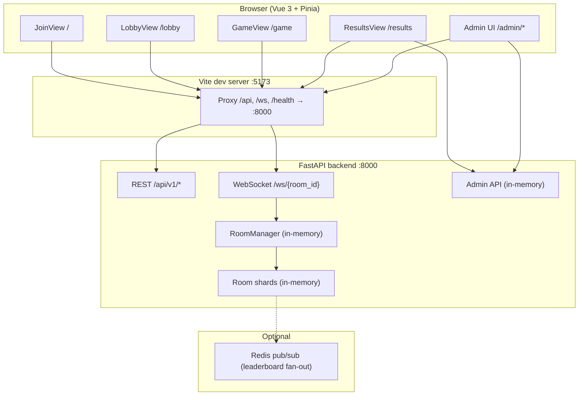
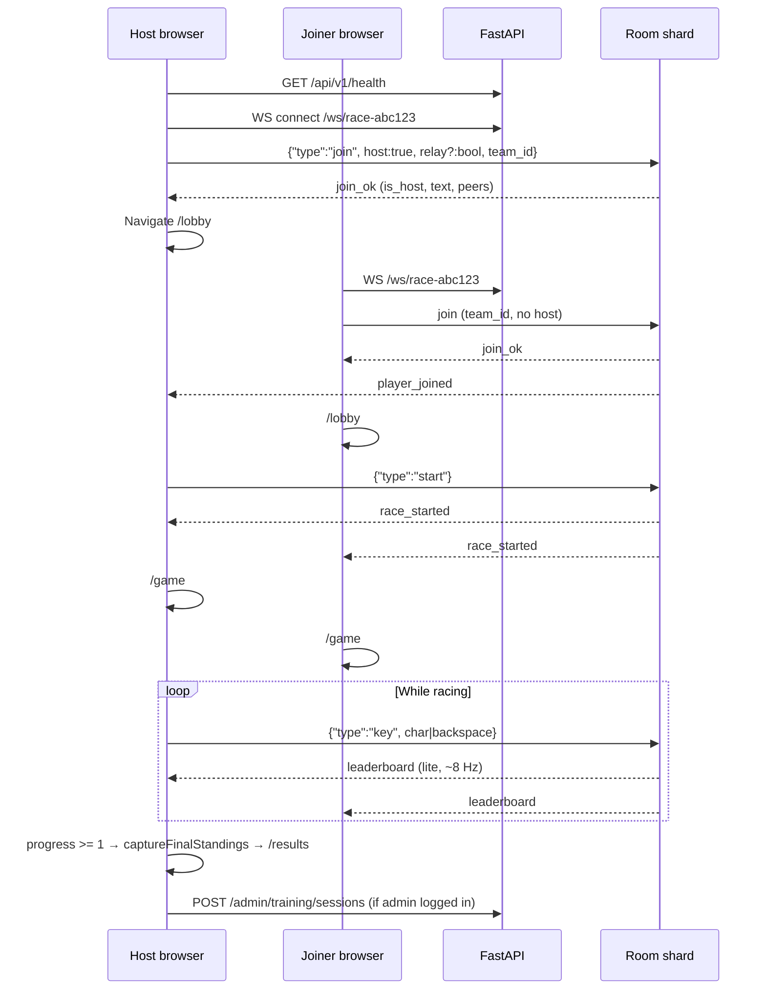
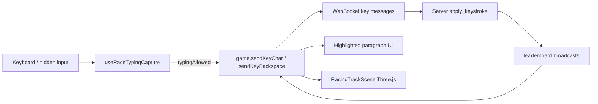
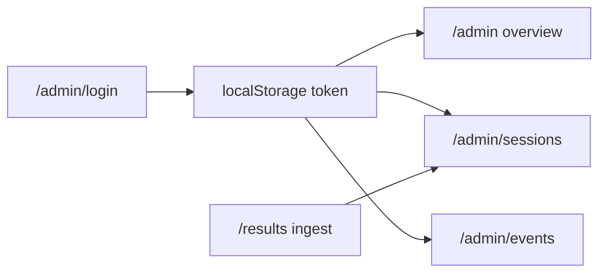

# Typing Race — Full Logical Workflow

This document describes how the **typing-race** project works end-to-end: user journeys, frontend routes, backend services, WebSocket protocol, game rules, and admin analytics.

---

## 1. System overview



| Layer | Technology | Persistence |
|-------|------------|-------------|
| Frontend | Vue 3, Vue Router, Pinia, Tailwind, Three.js (`RacingTrackScene`) | Session in Pinia until refresh |
| API | FastAPI, Uvicorn, Pydantic | **No database** — rooms/players in RAM |
| Realtime | WebSocket per room | Dies when backend stops or room empties |
| Admin | REST under `/api/v1/admin` | In-memory deque (events, sessions) |
| Optional | `REDIS_URL` in `backend/.env` | Publishes leaderboard snapshots only |

---

## 2. Local development flow

1. **Backend** — `cd backend && npm run dev` → Uvicorn on `http://0.0.0.0:8000`
2. **Frontend** — `cd frontend && npm run dev` → Vite on `http://localhost:5173`
3. Vite proxies `/api`, `/ws`, `/health` to `VITE_DEV_PROXY_TARGET` (default `http://127.0.0.1:8000`)

**Health check (must return typing-race API):**

```bash
curl -s http://127.0.0.1:8000/api/v1/health
# Expected: {"status":"ok","service":"typing-race-api"}
```

If you see `{"message":"FastAPI API is running"}` on `/`, **another app owns port 8000** — stop it or change `PORT` / `VITE_DEV_PROXY_TARGET`.

Before opening a WebSocket, the client calls `GET /api/v1/health` (via proxy or direct) in `game.ts` → `assertGameApiReachable()`.

---

## 3. Player journey (happy path)



### Step-by-step

| Step | Screen | What happens |
|------|--------|----------------|
| 1 | **Home** (`/`) | Host: **Create room** → `generateRoomId()` → `race-xxxxx`. Joiner: paste room ID or open `/?room=...`. |
| 2 | **Join form** | User enters name, picks Team A (`team_id=0`) or Team B (`1`). Host may enable **Relay mode** (locks for whole logical room on first join). |
| 3 | **Connect** | `game.connectAndJoin()` → health check → `WebSocket` to `/ws/{roomId}` → first message **must** be `join`. |
| 4 | **Lobby** (`/lobby`) | Shows room ID, invite link, player list. **Host** clicks **Start game** → `start` message. Others wait. |
| 5 | **Race** (`/game`) | On `race_started`, router goes to game. Keystrokes sent as `key` messages; UI shows paragraph + 3D track. |
| 6 | **Finish** | When **your** `progress >= 1`, client snapshots standings and navigates to **Results**. |
| 7 | **Results** (`/results`) | Standings table; optionally POSTs training session to admin API if company admin token exists in localStorage. |

### Router guards (`frontend/src/router/index.ts`)

| Route | Guard |
|-------|--------|
| `/lobby`, `/game` | Requires `game.playerId` (joined) → else redirect `/` |
| `/results` | Requires `game.finalStandings.length > 0` → else `/game` or `/` |
| `/admin/*` | Requires admin bearer token → else `/admin/login` |

---

## 4. Room identity and sharding

- **Logical room** = URL segment `{room_id}` (e.g. `race-k7m2xq`), validated `^[a-zA-Z0-9_-]{1,64}$`.
- **Physical shard** = in-memory `Room` with `storage_key = "{logical}#{shard_index}"`.
- `RoomManager.assign_room()` picks a shard with `occupancy < max_players_per_shard` (default **150**, clamp 50–200) or creates a new shard.
- **Logical config** (one per `logical_room_id`, shared across shards on this process):
  - `relay_mode` — set on **first** join that supplies `relay` in payload
  - `host_player_id` — first join with `host: true`
  - `started` — set when host successfully sends `start`

Rooms are **not** created by a separate REST “create room” call — the room exists when the first WebSocket connects and joins.

---

## 5. Teams and relay mode

### Teams

- Two teams: `team_id` **0** (UI: Team A) and **1** (Team B).
- **No per-team player cap** — only total shard cap (~150).
- Join with explicit `team_id` → always that team.
- Join without `team_id` → assigned to smaller team (`_pick_team`).

### Relay mode

- Enabled when **host** joins with `relay: true` (first join to logical room wins).
- Per team: one **active typist** at a time (`relay_active` on leaderboard).
- Rotation: `_relay_cursor` over `_team_orders[team_id]`.
- Active player may send `relay_pass` to hand off manually.
- Finishing the paragraph (`progress >= 0.999`) auto-advances relay for that team.
- Frontend `typingAllowed` requires WebSocket open **and** `isRelayTurn` when relay mode is on.

---

## 6. WebSocket protocol

**Endpoint:** `GET /ws/{room_id}` (upgrade)

### Client → server (after join)

| `type` | Payload | When |
|--------|---------|------|
| `join` | `{ name, team_id?, relay?, host? }` | **First** message only (handshake) |
| `key` | `{ char }` or `{ backspace: true }` | During race |
| `start` | `{}` | Host only, once per logical room |
| `relay_pass` | `{}` | Active relay typist |
| `leave` | `{}` | Voluntary leave |
| `pong` | `{}` | Response to server `ping` |
| `ping` | — | Optional |

### Server → client

| `type` | Purpose |
|--------|---------|
| `join_ok` | Player id, paragraph text, team, relay_mode, is_host, started, peers |
| `player_joined` | Another player entered (to existing connections) |
| `player_left` | Player removed |
| `race_started` | Host started; all clients navigate to game |
| `leaderboard` | Lite rows `p[]` + per-recipient `y` (your extended stats) |
| `room_meta` | Teams, team_rankings, relay state (when meta dirty) |
| `ping` | Keepalive (~10s); client should `pong` |
| `error` | `{ detail: "..." }` e.g. `join_first`, `start_rejected` |

### Connection lifecycle

- **Idle timeout:** ~45s without client activity → close code `4408`, player removed.
- **Server pings:** every ~10s while connected.
- Disconnect → `remove_player`, broadcast updates, maybe drop empty shard and logical config.

---

## 7. Typing and scoring (server authority)

All typing is validated on the server in `backend/app/game/typing_engine.py` via `apply_keystroke()`:

- **Wrong character:** increments `errors`, does **not** advance `typed_index` for that key, then applies a **one-step penalty**: `typed_index = max(0, typed_index - 1)` so the player must re-confirm the previous correct character (strict tutor-style).
- Client sends **keystrokes**, not full text.
- Server tracks `TypingRuntimeState` per player against a shared **paragraph** (`pick_paragraph(logical_room_id)`).
- Stats: WPM, accuracy, progress, typed_chars, errors.
- Rankings: sort by progress ↓, WPM ↓, typed_chars ↓, id.
- **Team scores** computed in `room.py` using `team_metrics` (teamwork, consistency, communication efficiency).

Leaderboard broadcast loop runs at **~8 Hz** (`broadcast_hz` in config), sending compact `leaderboard` messages to save bandwidth.

---

## 8. Frontend state (`stores/game.ts`)

Pinia store holds:

| State | Source |
|-------|--------|
| `roomId`, `playerId`, `paragraph`, `teamId` | `join_ok` |
| `isHost`, `raceStarted`, `relayMode` | `join_ok`, `race_started`, `start` errors |
| `players[]` | `leaderboard` lite merge, `player_joined` |
| `teams`, `teamRankings`, `relayState` | `room_meta` / full `leaderboard` |
| `finalStandings`, `finalTeams` | `captureFinalStandings()` on finish |

**WebSocket URL:** same origin `/ws/{room}` in dev (proxied); or `VITE_API_BASE_URL` for direct API host.

---

## 9. Game UI (`GameView.vue`)



- **Paragraph UI:** `typedText` = `paragraph.slice(0, typed_chars)` from server (readonly input mirror).
- **3D track:** `RacingTrackScene` maps `progress` → car position; gold beacon = your car.
- **Pause messages:** disconnected socket or not your relay turn.

---

## 10. Admin workflow (separate from multiplayer)

Not required to play. Uses REST + in-memory storage.



| Item | Default (demo) |
|------|----------------|
| Company slug | `acme` |
| Email | `admin@typingrace.local` |
| Password | `changeme` |

**Results page** may POST `POST /api/v1/admin/training/sessions` with final WPM, accuracy, synthetic `wpm_history` — feeds admin charts.

---

## 11. Key files map

| Area | Path |
|------|------|
| Routes | `frontend/src/router/index.ts` |
| Game state + WS | `frontend/src/stores/game.ts` |
| Join / host | `frontend/src/views/JoinView.vue` |
| Lobby / start | `frontend/src/views/LobbyView.vue` |
| Race UI | `frontend/src/views/GameView.vue`, `composables/useRaceTypingCapture.ts` |
| 3D race | `frontend/src/components/RacingTrackScene.vue` |
| Results + ingest | `frontend/src/views/ResultsView.vue` |
| WS handler | `backend/app/game/ws_room.py` |
| Room logic | `backend/app/game/room.py` |
| Sharding / host / start | `backend/app/game/manager.py` |
| Models / messages | `backend/app/game/models.py` |
| Config | `backend/app/core/config.py` |
| Admin | `backend/app/admin/router.py`, `admin/state.py` |

---

## 12. Failure modes (operational)

| Symptom | Likely cause |
|---------|----------------|
| “Cannot reach the game API” | Backend down or wrong process on :8000 |
| WebSocket 1006 after health OK | Proxy misconfig; restart Vite + backend |
| “Disconnected” in game | Idle timeout, backend restart, no `pong` (fixed in client) |
| `start_rejected` | Not host, race already started, or stale backend |
| Empty room after restart | Expected — in-memory state lost |
| Can’t create room | Usually API unreachable; room ID is client-generated, join creates server room |

---

## 13. Data flow summary

1. **No SQL** for gameplay — rooms live in the API process.
2. **Paragraph + progress** are server-owned; clients are thin terminals for keys.
3. **Host** controls start; **relay** controls who may type per team.
4. **Leaderboard** pushes drive both UI and 3D track.
5. **Admin** is an optional analytics sink fed from results ingest, not from live WS.

---

*Generated from the typing-race codebase structure. Update this doc when WS message types or routes change.*
